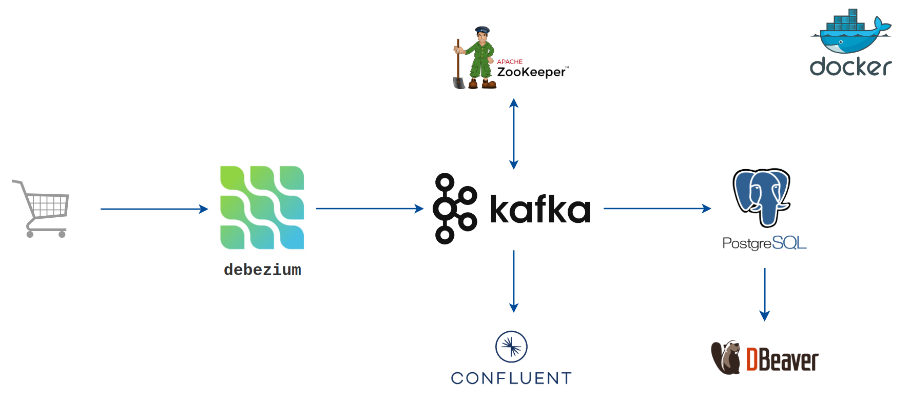

# CDC with Debezium, Kafka, Postgres, Docker

## Overview

This Python script is designed to generate simulated financial transactions and insert them into a PostgreSQL database. It's particularly useful for setting up a test environment for Change Data Capture (CDC) with Debezium. The script uses the `random` library to create realistic data and inserts it into a PostgreSQL table.

## System Architecture

<p align="center">


<p align="center">
    System Architecture
</p>

## Prerequisites

Before running this script, ensure you have the following installed:

- Python 3.10
- Docker
- Debezium (Debezium UI)
- PostgreSQL
- Confluent Containers (Zookeeper, Kafka, Schema Registry, Connect, Control Center)
- DBeaver

## Getting Started

1. **Clone the repository**:

   ```bash
   git clone https://github.com/trannhatnguyen2/cdc-streaming.git
   ```

2. **Install Python dependencies**:

   ```bash
   pip install -r requirements.txt
   ```

3. **Run Docker Compose**:

   ```bash
   docker compose -f docker-compose.yml up -d
   ```

   This command will download the necessary Docker images, create containers, and start the services in detached mode.

4. **Access the Services**

   - Kafka Control Center is accessible at `http://localhost:9021`.
   - Debezium UI is accessible at `http://localhost:8080`.
   - Postgres is accessible on the default port `5432`.

## How it works

1. **Create Connector Postgres to Debezium**

   Firstly, modifying your config in config/postgresql-cdc.example.json

   ```bash
   bash streaming/run.sh register_connector configs/postgresql-cdc.json
   ```

2. **Create an empty table in PostgreSQL**

   ```bash
   python streaming/utils/create_table.py
   ```

3. **Periodically insert a new record to the table**

   ```bash
   python streaming/utils/insert_table.py
   ```

4. **Print records as json format in terminal**

   ```bash
   python streaming/json_consume_message.py
   ```

---

<p>&copy; 2023 NhatNguyen</p>
